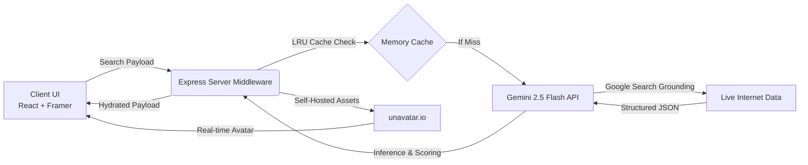

<div align="center">
  

  <br />
  <br />

  <h1>🔮 AuraScore AI</h1>

  <p>
    <strong>A highly dynamic, AI-powered social engagement profiler.</strong><br/>
    Built with React, Framer Motion, and the Google Gemini SDK.
  </p>

  <p>
    
    
    
    
    
    
  </p>
  
  <br />
</div>

## 📖 Overview

**AuraScore AI** is a professional-grade social intelligence dashboard that replaces legacy scraping with **Gemini Search Grounding**. It dynamically indexes real-time X (Twitter) profile data through the Google Search engine, hydrates it into a stunning Glassmorphism UI, and provides high-fidelity social sharing capabilities.

### ✨ Key Features
- **Gemini Search Grounding:** Bypasses legacy scraping using Gemini's native `googleSearch` capability to live-index and extract real-time X profile statistics.
- **Deterministic Color Identity:** Implements a high-entropy bitwise string-hash to generate unique, consistent color palettes for every user.
- **Social Export Suite:** Integrated `html-to-image` for PNG generation, native OS Sharing (Web Share API), and a "Post to X" web intent.
- **Enterprise-Grade Backend:** Hardened with **Zod** validation, **LRU-Caching**, **Helmet/CORS** security, and standardized error schemas.

---

## 🏗️ Architecture



---

## 🚀 Quick Start (Local)

To run this application locally outside of Docker, ensure you have Node.js (`v22.x` or higher) installed.

```bash
# 1. Clone the repository
git clone https://github.com/HemachandRavulapalli/AuraScoreAI.git
cd AuraScoreAI

# 2. Setup your environment keys in .env
GEMINI_API_KEY="your_api_key_here"

# 3. Start the project
npm install
npm run dev
```

Open **`http://localhost:3000`** to view the application.

---

## 🛡️ Security & Reliability

This project is built for production environments:
- **Zero-Dependency Inference:** Uses native REST calls to Gemini to minimize bundle size.
- **Request Buffering:** Prevents API spam via in-memory caching.
- **Deterministic UI:** Every `@username` has a unique "Aura" that is mathematically derived from their handle.
